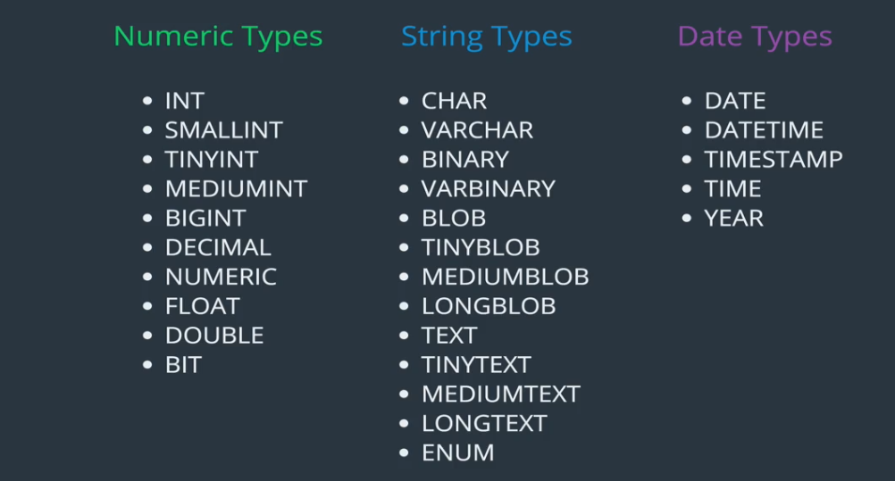

## run my_sql in terminal 

  /usr/bin/mysql -u root -p   [comment]: <> (my password- sudo)
     


# basic command

1. create database <database_name>; 
2. show databases; 
3. drop database <database_name>;
4. use <database_name>;
5. select databse(); [comment]: <> (show currently use database); 


# data_types




# create a table

 ```js 
   CREATE TABLE <tableName>
    (
      colum_name data_type, 
      colum_name data_type
    )

   ```

   example create cats table

  ```js
   CREATE TABLE cats
   (
     name VARCHAR(100),
     age INT
   )
```
## tablse comand

1. SHOW TABLES;  [comment]: <> (show currently use database's table); 
2. SHOW COLUMNS FROM <tables_name>;  [comment]: <> (shortcut command    DESC <table_name>);
3. DROP TABLE <tables_name>

# insert data into tables 

```js
 INSERT INTO cata(name, age)
 VALUES ('Jetson', 7); 

 ```

 # Not Null 

  ```js
   CREATE TABLE cats
   (
     name VARCHAR(100) NOT NULL,
     age INT NOT NULL
   )
```

# set default value

# Not Null 

  ```js
   CREATE TABLE cats
   (
     name VARCHAR(100) NOT NULL DEFAULT 'unnamed',
     age INT NOT NULL DEFAULT 99
   )

```


# set primry key

   ```js
   CREATE TABLE cats
   (
     cat_id INT NOT NULL  AUTO_INCREMENT,
     name VARCHAR(100) ,
     age INT , 
     PRIMARY KEY(cat_id)
   )

```